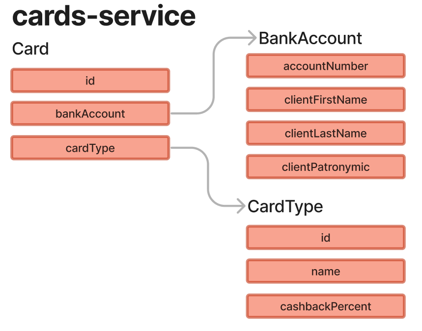

# 💳 Cards Microservice

This microservice is responsible for storing users' cards and bank accounts.

# 📝 .xtend Models

There are 3 .xtend models within this microservice:

- [CardType.xtend](https://gitlab.croc.ru/CROC.DRPO_RnD/jxfw/sandbox/school2023/team4/cards-service/-/blob/main/src/main/java/ru/croc/cards/domain/CardType.xtend)
- [Card.xtend](https://gitlab.croc.ru/CROC.DRPO_RnD/jxfw/sandbox/school2023/team4/cards-service/-/blob/main/src/main/java/ru/croc/cards/domain/Card.xtend)
- [BankAccount.xtend](https://gitlab.croc.ru/CROC.DRPO_RnD/jxfw/sandbox/school2023/team4/cards-service/-/blob/main/src/main/java/ru/croc/cards/domain/BankAccount.xtend)

# ↔️ The relationship between the entities can be represented by the following diagram.



# 📥 Endpoints

This microservice has only one REST endpoint:
/api/v1/cards/get-card-type - Get information about card by bank account number

`How to use this endpoint?`

You should send BankAccountDTO in json format, for example:

```json
{
    "bankAccount": "8e963107-1aaf-4b90-ae0d-9fd2e2f71a41"
}
```

And if the bank account number is valid and there is a card linked to this bank account number, you will receive `200 OK` status code and CardDTO also in json format, for example:

```json
{
    "cardTypeName": "HIPSTER_BLACK",
    "cashbackPercent": 2.5,
    "minBalanceForCashback": 90000
}
```

But if bank account is not in database, you will receive `400 Bad Request` status code and error message in json:

```json
{
    "message": "Card with bank account number 8e963107-1aaf-4b90-ae0d-9fd2e2f71a41 was not found in database!"
}
```

